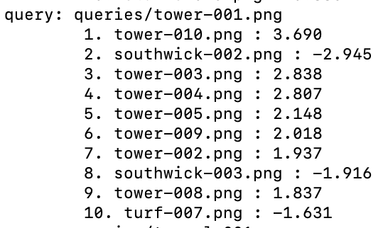

# Commands
### Generate Index
`python index.py --dataset images --index index.cpickle`

### Query All Images
`python search.py --dataset images --index index.cpickle`


### Generate Master Results
`python gen_results.py --dataset images --index index.cpickle`

# Results

I calculated a total score for each location by taking the top 10 matches for each query image,
and consider their error scores (lower individual error score means better match). `total_score = sum of 1 / error_score * C` where C is either 1 if its a correct match or -1 if it is not.
This total score calculator rewards caorrectness and punishes incorrectness proportionally to how confident it is on its selection. If it is very confident and incorrect it is punished a lot, and if it is only a little confident and is correct, it is only rewarded a little.

| name      | total score | Accuracy (out of 10) |
| --------- | ----------- | -------------------- |
| garage    | 34.5        | 10                   |
| rocks     | 28.5        | 10                   |
| alley     | 19.4        | 9                    |
| stairs    | 12.6        | 9                    |
| tower     | 10.8        | 7                    |
| rslofts   | 6.8         | 6                    |
| tunnel    | 3.7         | 7                    |
| grundle   | 2.8         | 2                    |
| southwick | -5.6        | 4                    |
| turf      | -6.8        | 3                    |

## Individual Scores


# Helpful Commands

## Convert any HEIC image in a directory to PNG format
```magick mogrify -monitor -format png *.HEIC```

## Rename pictures in directory
```
INDEX=1
for file in *.png
do
num=$(printf "%03d" $INDEX)
mv "$file" "tunnel-${num}.png"
let INDEX=${INDEX}+1
done
```
